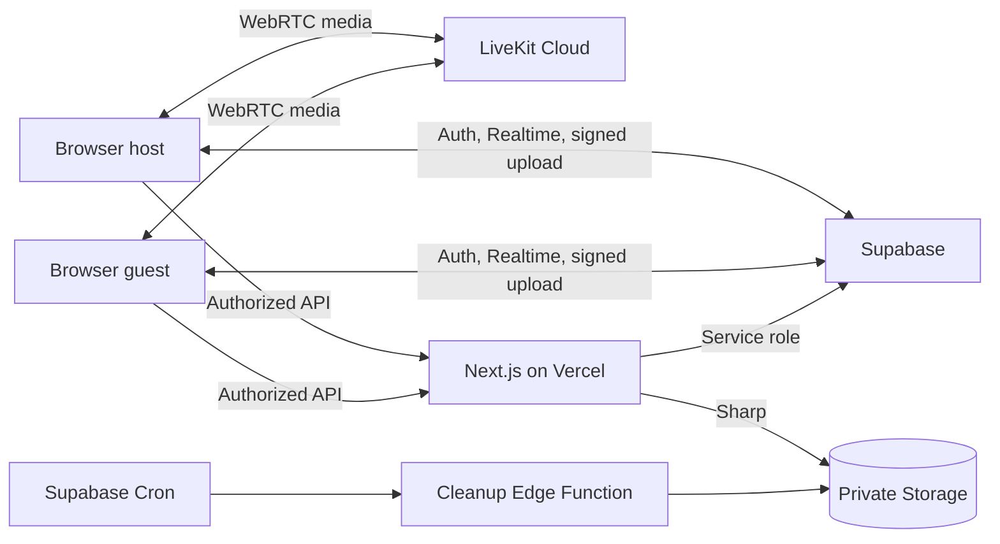

# Arsitektur

Invitation token mentah hanya berada pada URL. Server menggabungkannya dengan pepper, membuat SHA-256, dan mengunci row invitation saat accept. Start session mengunci room, memeriksa host, dua peserta yang connected+ready, lalu membuat session dan capture event dalam satu transaksi.

LiveKit hanya membawa video/audio realtime dan tidak merekam. Supabase Realtime membawa metadata room, ready, session, capture event, dan status upload. Foto lokal dikompresi menjadi WebP, diunggah melalui signed URL ke bucket privat, lalu server memverifikasi membership serta path yang diturunkan server.

Sharp mengunduh tepat `total_shots × 2` object yang confirmed, decode/crop cover, menerapkan konfigurasi tema, dan mengunggah result serta thumbnail. Row result unik per session menjadikan generation idempotent.

Security boundary: browser hanya memiliki publishable key; service role, LiveKit secret, invitation pepper, dan cron secret hanya tersedia pada runtime server. RLS menjadi defense-in-depth, sedangkan route handler memegang mutasi sensitif.
