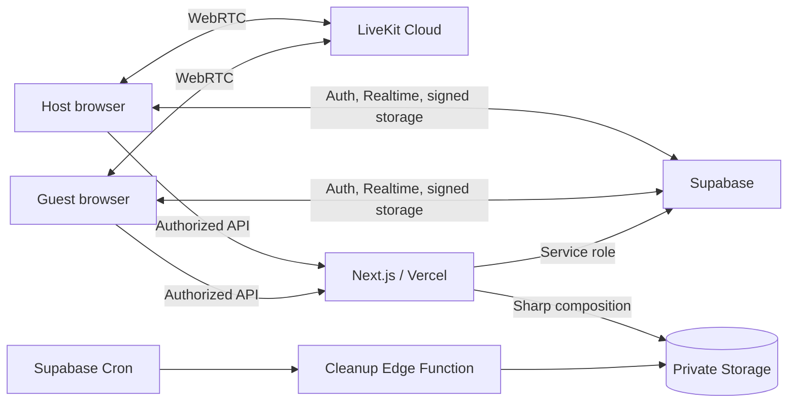

# PhotoBox GT

PhotoBox GT adalah photobox online privat untuk dua orang yang berada di lokasi berbeda. Host membuat room dan mengirim tautan undangan satu kali; kedua peserta bertemu melalui video LiveKit, mengambil foto secara tersinkron, lalu memperoleh strip photobox yang dirangkai server dengan Sharp.

## Fitur utama

- Anonymous authentication berbasis Supabase Auth dan cookie SSR.
- Room privat berkapasitas maksimal dua peserta.
- Invitation token acak 256-bit, ber-pepper, di-hash SHA-256, sekali pakai, dan kedaluwarsa.
- Waiting room realtime dengan kamera, mikrofon, device selector, ready state, dan reconnection.
- Countdown berdasarkan waktu server dan capture WebP sampai delapan pose.
- Private signed upload/download URL dengan validasi MIME, ukuran, checksum, membership, dan storage path.
- Komposisi strip 1200×1800 menggunakan Sharp, lima tema, thumbnail, share, retake, dan delete.
- RLS, RPC atomik, private Storage, Realtime publication, audit events, serta cleanup Edge Function.
- Responsive dark navy/pink interface dengan keyboard focus dan reduced-motion support.

## Stack

- Next.js 16 App Router, React 19, TypeScript strict, Tailwind CSS
- Supabase PostgreSQL, Anonymous Auth, Realtime, Storage, RLS, Edge Functions
- LiveKit Cloud dan React Components
- Sharp
- Vitest dan Playwright
- Vercel

## Arsitektur ringkas



Penjelasan lengkap tersedia di [ARCHITECTURE.md](./ARCHITECTURE.md).

## Menjalankan secara lokal

Prasyarat:

- Node.js 20 atau lebih baru
- npm
- Project Supabase
- Project LiveKit Cloud

```bash
git clone https://github.com/wholelottarido/photobox.git
cd photobox
npm install
```

Salin environment template:

```powershell
Copy-Item .env.example .env.local
```

Isi `.env.local`:

```env
NEXT_PUBLIC_APP_URL=http://localhost:3000
APP_ENV=development
NEXT_PUBLIC_ENABLE_DEMO_REMOTE=false

NEXT_PUBLIC_SUPABASE_URL=https://PROJECT_REF.supabase.co
NEXT_PUBLIC_SUPABASE_PUBLISHABLE_KEY=sb_publishable_...
SUPABASE_SERVICE_ROLE_KEY=sb_secret_...

NEXT_PUBLIC_LIVEKIT_URL=wss://PROJECT.livekit.cloud
LIVEKIT_API_KEY=API...
LIVEKIT_API_SECRET=...

INVITATION_TOKEN_PEPPER=<RANDOM_SECRET>
CLEANUP_CRON_SECRET=<DIFFERENT_RANDOM_SECRET>
```

Hasilkan masing-masing secret secara terpisah:

```bash
node -e "console.log(require('crypto').randomBytes(48).toString('base64url'))"
```

Jangan commit `.env.local`.

## Menyiapkan Supabase

Aktifkan **Anonymous Sign-Ins**, kemudian jalankan secara berurutan:

1. `supabase/migrations/0001_initial_schema.sql`
2. `supabase/migrations/0002_rls_policies.sql`
3. `supabase/migrations/0003_storage_and_realtime.sql`
4. `supabase/migrations/0004_cleanup_jobs.sql`
5. `supabase/seed.sql`

Melalui CLI:

```bash
npx supabase login
npx supabase link --project-ref <PROJECT_REF>
npx supabase db push --include-seed
```

Pastikan tabel `photobox_themes` berisi lima tema aktif dan bucket `photobox-raw` serta `photobox-results` bersifat private.

## Development

```bash
npm run dev
```

Buka `http://localhost:3000`.

## Quality gate

```bash
npm run lint
npm run typecheck
npm run test
npm run build
npm run test:e2e
npm run validate:cloud
```

E2E dua peserta memerlukan Supabase, LiveKit, HTTPS, dan browser fake-media atau dua perangkat nyata.
`validate:cloud` memeriksa schema, bucket, endpoint Auth, dan LiveKit API tanpa mencetak credential.

## Deployment

Project siap di-deploy melalui Vercel:

1. Import repository `wholelottarido/photobox`.
2. Gunakan framework preset Next.js.
3. Tambahkan seluruh variable dari `.env.example` untuk Preview dan Production.
4. Jalankan deployment pertama.
5. Ubah `NEXT_PUBLIC_APP_URL` menjadi URL production Vercel, lalu redeploy.
6. Tambahkan domain production ke Supabase Authentication URL Configuration.
7. Uji invitation URL pada incognito atau perangkat kedua.

Panduan lengkap, Edge Function, Cron, LiveKit, environment, dan checklist production tersedia di [DEPLOYMENT.md](./DEPLOYMENT.md).

## Keamanan dan privasi

- Video dan audio tidak direkam.
- Raw photo hanya digunakan untuk menghasilkan strip dan memiliki masa simpan terbatas.
- Browser tidak menerima Supabase secret key, LiveKit API secret, invitation pepper, atau cron secret.
- Invitation URL berbeda dari room code dan hanya dapat diterima sekali.
- Semua bucket file bersifat private.

Lihat [SECURITY.md](./SECURITY.md) dan [PRIVACY.md](./PRIVACY.md).

## Status verifikasi

- TypeScript strict
- ESLint
- Unit tests
- Next.js production build
- Production dependency audit

Deployment cloud membutuhkan credential pemilik project dan tidak dianggap selesai sampai URL production dapat diuji.
